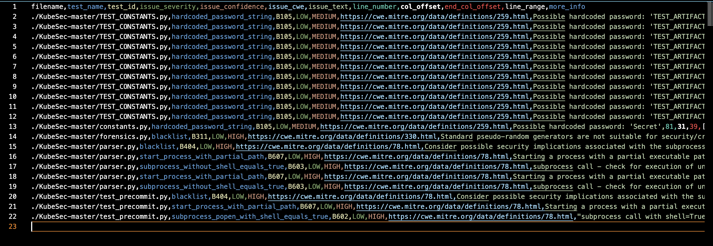

# COMP 5710 Group Project

## Team Information

- **Team Name**: PENPALS-SQA2025-AUBURN
- **Team Members**: Aidan Miller, Jordyn Godsey, and Thomas Pohler

## Task Assignments

We split the work up between each team member as follows:

- **4a.** Aidan Miller
- **4b.** Thomas Pohler
- **4c.** Jordyn Godsey

After completing these tasks, we then worked together to push the files onto our GitHub Repo and test them in a unified environment.

---

## Activities Completed

### 1. Unpacked Project
- Successfully unpacked `KubeSec.zip` to access the provided Python project files.

### 2. GitHub Repository Setup
- Created a shared GitHub repository following the naming convention and uploaded all project files to the repository.

### 3. Created README.md
- Added a README.md listing the team name and all team members at the top of the repository.

### 4. Software Quality Assurance Activities

#### 4a. Git Hook for Security Scanning
- Implemented a Git pre-commit hook that runs a security scan on all `.py` files.
- Used `bandit` to detect security vulnerabilities.
- Configured the hook to generate a report of findings into `bandit_report.csv`.
  
  
- The hook triggers automatically every time any Python file within the project is changed and committed.

#### 4b. Fuzz Testing (`fuzz.py`)
- Created a `fuzz.py` script that fuzzes 5 selected Python methods, based of a modified implementation of the simpleFuzzer from Workshop 7. The script takes as input a function name and a list of test data, which comprises all of the arguments that are intended to be sent to the function; functions are then fuzzed in a for-loop that goes through each of the arguments and inputs them into the function, allowing for many function executions with different types of inputs very quickly and easily.
- Added some extra features to help with testing, such as whether there is an error is recorded in the "pass"/"fail" metrics, which print out after execution the percentage of test cases that passed. This can be disabled via the optional should_print_output parameter in the function; similarly, the optional should_print_stack_trace parameter determines whether the stack trace of errors should be printed to the console or not.
- I had some slight issues with certain inputs crashing my make_temp_file() helper function and subsequently halting execution (since the make_temp_file() call is placed outside the fuzzer's try/catch blocks), but I otherwise did not have any serious difficulties building this fuzzer.
- Integrated `fuzz.py` with GitHub Actions to run automatically during CI.
- Documented bugs discovered (also reported in further detail in a comment inside Fuzz.py):
  - **find_json_path_keys**: crashes on non-string dictionary keys (floats, None, frozenset).
  - **count_initial_comment_line**: crashes with `FileNotFoundError` when input file path doesn't exist.
  - **getValidTaints**: crashes with invalid input types (ValueError, TypeError).
  - **scanForResourceLimits**: crashes with `FileNotFoundError` on missing files.
  - **scanForSecrets**: error is caught properly, does not crash.

#### 4c. Forensics Integration (`forensics.py`)
- Selected 5 Python methods and added forensic logging to each.
- Logging includes timestamps, method execution results, and important variable states.
- Created `forensics.py` to run and verify forensic logging.
- Automated running of `forensics.py` via GitHub Actions.

---

## What We Learned

- **Python Scripting**: Gained hands-on experience modifying existing codebases.
- **Git and GitHub Workflow**: Strengthened version control skills and learned Git Hooks.
- **Static Analysis**: Understood the importance of early vulnerability detection.
- **Fuzz Testing**: Learned how random input testing can reveal hidden code bugs.
- **Forensics and Logging**: Practiced detailed event logging to support system audits.
- **Continuous Integration (CI) Pipelines**: Built automated workflows with GitHub Actions.
- **Collaboration and Teamwork**: Improved task distribution and team integration practices.

---

## Notes

- **Repository**: [GitHub Repository Link](https://github.com/amm0261/PENPALS-SQA2025-AUBURN)

- **Main Files**:
  - `forensics.py`
  - `fuzz.py`
  - `pre-commit`
  - `bandit_report.csv`
  - `.github/workflows/forensics.yml`
  - `.github/workflows/fuzz_testing.yml`
